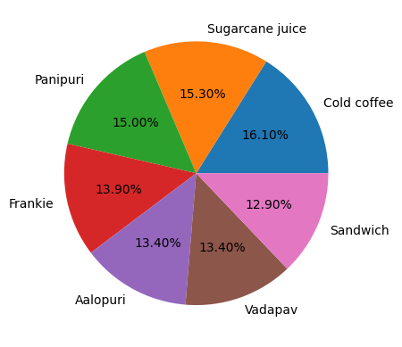

Exploratory Data Analysis of a Fast-food shop to cover the sales trend

Dataset

The dataset contains transactional records from the restaurant over a specific period. The data was sourced from https://www.kaggle.com/datasets/rajatsurana979/fast-food-sales-report

Description:
This dataset captures sales transactions from a local restaurant near my home. It includes details such as the order ID, date of the transaction, item names (representing various food and beverage items), item types (categorized as Fast-food or Beverages), item prices, quantities ordered, transaction amounts, transaction types (cash, online, or others), the gender of the staff member who received the order, and the time of the sale (Morning, Evening, Afternoon, Night, Midnight). The dataset offers a valuable snapshot of the restaurant's daily operations and customer behavior.

Features:

order_id: a unique identifier for each order.
date: date of the transaction.
item_name: name of the food.
item_type: category of item (Fastfood or Beverages).
item_price: price of the item for 1 quantity.
Quantity: how much quantity the customer orders.
transaction_amount: the total amount paid by customers.
transaction_type: payment method (cash, online, others).
received_by: gender of the person handling the transaction.
time_of_sale: different times of the day (Morning, Evening, Afternoon, Night, Midnight).

Tools & Libraries Used

Python
Pandas: For data cleaning and manipulation.
NumPy: For numerical operations.
Matplotlib: For creating insightful data visualizations.
Scikit learn:For Transforming categorical data and to scale.

Key Findings & Visualizations

This analysis revealed several key insights into the restaurant's operations:

Peak Hours: The busiest time of day is the night rush
Best-Selling Items: The most popular menu item is the Cold Coffee, followed by Sugarcane juice.

